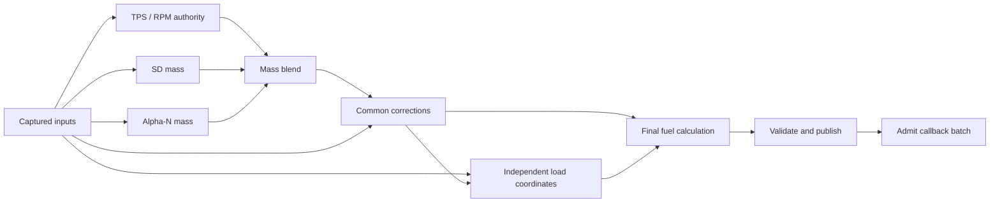

# Airmass models, load coordinates, and injection admission

Documentation revision 4 · 2026-10-02

This branch separates the calculation of cylinder air mass, the load coordinate used by each consumer, and permission to schedule new fuel pulses. Dedicated Speed Density (SD), Alpha-N, and MAF maps preserve each model's calibration. The combined SD/Alpha-N strategy evaluates both contributions from shared inputs, blends their masses, and applies common corrections once. Injection admission follows a complete validated fuel result.

The dedicated maps and separate VE Analyze targets allow SD to be calibrated at 100% SD authority and Alpha-N at 100% Alpha-N authority in separate qualified sessions. The final blend reuses those same maps and their natural axes. This is why map ownership and analyzer routing are part of the combined-model design.

The practical result is that a tuner can change model contribution or a consumer's coordinate without redefining the other model maps. Developers can evaluate a model for diagnostics without authorizing injection, and a calculation started before a tune change cannot publish stale fuel quantities afterward.

For the capability comparison, controls, and calibration compatibility, see the [operator guide](../user/blended-airmass.md). This reference describes the current contracts and their implementation.

## Architectural differences from upstream

The baseline is FOME upstream
[`178ecaff6516`](https://github.com/FOME-Tech/fome-fw/tree/178ecaff6516607a68e77bdcca017ed5bef195a8),
the upstream base used for this implementation. Comparisons below refer to that revision.

| Area | Upstream behavior | Behavior here and purpose |
| --- | --- | --- |
| Main calibration | SD, Alpha-N, and MAF share the VE table and its load override. | Each model owns a map and both axes with a fixed physical meaning. The three calibrations can coexist without reusing one table for different quantities. |
| Combined models | One selected airmass model. | `LM_SD_ALPHA_N` combines SD and Alpha-N masses using a TPS/RPM authority table. Common corrections apply once. |
| Temperature | SD uses Tcharge; Alpha-N uses fixed 20 °C or optional IAT. | SD and Alpha-N can use Tcharge or IAT and share one captured temperature in a blended calculation. Temperature fallbacks are explicit in diagnostics. |
| Pressure | SD always evaluates the MAP estimate and can use it as a fallback; Alpha-N uses standard pressure. | MAP estimation requires permission and a valid calibration. Pure Alpha-N can use BARO compensation; standalone Multiply MAP uses effective MAP. Measured and effective MAP remain distinct coordinates. |
| Load consumers | Target lambda and main ignition have selectors; many other functions inherit shared loads or read sensors directly. | Additional functions choose their own sources from a shared snapshot with validity. For example, staging and lambda protection no longer need to inherit another table's source. |
| Model recovery | Each standalone model has its own sensor fallbacks. | The blend can promote a healthy branch to full authority and expose the substitution. Optional correction or actuator failures retain local recovery policies. |
| Injection | Opening and closing actions are scheduled individually, without the publication contract described here. | Revised models require complete valid fuel publication. Epoch/version checks reject stale results, and queue capacity is reserved for a complete callback batch before insertion. |
| Analysis and diagnostics | VE Analyze targets the shared VE map and existing logs expose its load and value. | Analysis targets a dedicated model map; blended qualification requires a uniform endpoint for the running session. Logs expose both branch masses, authority, pressure provenance, and per-consumer coordinates. |

The upstream implementations can be inspected in
[airmass](https://github.com/FOME-Tech/fome-fw/tree/178ecaff6516607a68e77bdcca017ed5bef195a8/firmware/controllers/algo/airmass),
[fuel calculation](https://github.com/FOME-Tech/fome-fw/blob/178ecaff6516607a68e77bdcca017ed5bef195a8/firmware/controllers/algo/fuel_math.cpp),
and the [TunerStudio definition](https://github.com/FOME-Tech/fome-fw/blob/178ecaff6516607a68e77bdcca017ed5bef195a8/firmware/tunerstudio/tunerstudio.template.ini).

### Compatibility boundaries

The measured MAF conversion, dual-MAF sensor recovery, Idle VE taper, normal priming conditions, and downstream fuel corrections retain their upstream roles. The 200 kPa MAP and 100% TPS/pedal load substitutes also come from upstream. Source validity and explicit fallback diagnostics make those substitutions distinguishable from healthy inputs.

The new validation honors the existing configured TPS/pedal tolerance and clamps tolerated endpoint offsets for table coordinates. The BMW M73 preset retains its intended 45% Alpha-N filling in the dedicated map. These preserve existing behavior while the underlying table and validation contracts change.

The expanded persistent layout requires a matching INI and manual calibration transfer. The former general VE-axis override and fixed-temperature Alpha-N selection are not exposed. Lua retains its legacy model and admission path; the complete physical-model publication contract applies to SD, Alpha-N, MAF, and SD + Alpha-N. See [calibration compatibility](../user/blended-airmass.md#compatibility-with-upstream-tunes) for equivalent equations and their limits.

The model implementations are in [airmass](../../firmware/controllers/algo/airmass/), the load resolver is in [airmass_loads.cpp](../../firmware/controllers/algo/airmass_loads.cpp), and calibration declarations are in [fome_config.txt](../../firmware/integration/fome_config.txt).

## Calculation and publication

The combined strategy has the following data flow. Idle VE is evaluated inside its owning branch; standalone modes use only their selected model.



Model and correction evaluation produce a candidate air mass. Active consumers resolve their selected coordinates, and the fuel path validates the resulting per-cylinder quantities before publication. The publication context ties that result to the current strategy and configuration. This prevents an incomplete calculation or a diagnostic query from becoming permission to inject.

`evaluateRawAirmass()` and `evaluateRawVe()` calculate raw model results without publishing diagnostic state or applying common VE corrections. The `evaluateAirmass()` interfaces support local diagnostic capture; `getAirmassForFuel()` selects publication for the active fuel calculation. Calling a model with `postState=false`, including a Lua model query, does not authorize injection.

This distinction allows both blended contributions to share inputs and keeps a diagnostic evaluation from replacing active fuel state. Diagnostic output is separate from admission: only the completed fuel path can make a calculation ready. See [airmass.h](../../firmware/controllers/algo/airmass/airmass.h), [airmass.cpp](../../firmware/controllers/algo/airmass/airmass.cpp), and [engine2.cpp](../../firmware/controllers/algo/engine2.cpp).

### Captured inputs

`captureAirmassInputs()` records RPM, TPS, measured MAP, IAT, pedal position, BARO, driver throttle intent, idle activity, displacement, cylinder count, and lambda/ignition selectors. It also records the publication epoch, configuration version, and active strategy. Both blended contributions receive this same object.

This is a shared calculation snapshot, not simultaneous hardware sampling. Common correction channels that are already in the object use those values. Other correction channels are sampled once per distinct channel within the correction pass. Fuel-load and ignition-load correction inputs use the previous published loads, avoiding recursion through the mass being calculated. Derived EGT and GPPWM channels expose finite values through this interface without proving the health of their underlying sensors.

TPS and pedal coordinates accept finite, valid sensor readings within the configured TPS error limits, which default to −10% through 110% and are captured with the sensor values. Values within that tolerance are clamped to 0–100% for airmass maps, authority, MAP estimation, corrections, and load consumers. This endpoint clamping does not indicate degraded operation. Invalid sensors, nonfinite readings, and values outside the configured limits remain invalid.

### Temperature and pressure policies

| Input or policy | Contract |
| --- | --- |
| Tcharge | Use the current rate-limited charge-temperature state in kelvin when valid. If it is invalid, use valid IAT; if neither is valid, use 20 °C. Airflow-based estimation retains its dependency on the previous mass calculation. |
| IAT | Use a valid finite IAT sample. If it is invalid, use 20 °C, matching the existing Alpha-N fallback. |
| Measured MAP | A valid finite value from 0 to 1000 kPa. It remains separately selectable even when an estimate supplies effective MAP. |
| Effective MAP | Normally measured MAP. If estimation is enabled, an invalid measured MAP can use the calibrated estimate. During an enabled acceleration transient, use the larger valid measured/estimated value; a bad estimate does not invalidate valid measured MAP. |
| MAP estimate | Requires explicit permission, valid RPM, increasing axes, and table values from 0 to 600 kPa. An evaluated estimate uses 0% if TPS is invalid and reports fallback, retaining upstream's lookup coordinate. It has no BARO scaling. A disabled or unusable estimate cannot repair invalid measured MAP. |
| Pure Alpha-N | Use 101.325 kPa, optionally multiplied by valid BARO divided by the fixed calibration reference pressure. |
| Standalone Multiply MAP | Use effective MAP as Alpha-N pressure. BARO compensation is inactive. Blended Alpha-N always uses the pure reference policy, independently of this option. |

Valid BARO for Alpha-N compensation is finite, greater than zero, and at most 200 kPa. Startup BARO captured from MAP has its own 60–110 kPa acceptance range. If BARO compensation is enabled but BARO is invalid, its coefficient becomes the neutral value 1; diagnostics continue to report that BARO was unavailable. Without compensation, BARO is not an Alpha-N mass dependency unless another active consumer uses it.

See `captureAirmassInputs()` and `resolveCapturedMap()` in [speed_density_airmass.cpp](../../firmware/controllers/algo/airmass/speed_density_airmass.cpp), `alphaNPressure()` in [alphan_airmass.cpp](../../firmware/controllers/algo/airmass/alphan_airmass.cpp), and [map.cpp](../../firmware/controllers/sensors/impl/map.cpp).

## Maps and mass equations

Let `V` be displacement per cylinder in litres, `T` the selected temperature in kelvin, `P` pressure in kPa, and `R = 0.28705`. The ideal gas calculation returns grams:

```text
idealCharge(V, P, T) = V × P / (R × T)
mSD = (SD_VE / 100) × idealCharge(V, effectiveMAP, T)
mAN = (AlphaN_filling / 100) × idealCharge(V, 101.325 × B, T)
B = BARO / referencePressure when compensation is enabled; otherwise 1
```

Standalone Alpha-N with Multiply MAP replaces `101.325 × B` with effective MAP. The two blended branches use the same selected temperature. Their calibration values have different meanings: SD VE describes filling at manifold pressure; Alpha-N describes filling at reference pressure.

| Calibration | Coordinate | Meaning and storage |
| --- | --- | --- |
| SD `veTable`, 16 × 16 | Effective MAP / RPM | VE percent, 0.1% cells; 1 kPa and 1 RPM axes. |
| `alphaNTable`, 16 × 16 | TPS / RPM | Reference filling percent, 0.1% cells; 0.01% TPS and 1 RPM axes. |
| `mafTable`, 16 × 16 | Uncorrected measured filling / RPM | MAF mass correction percent; 100% is neutral. Cells are 0.1%; filling and RPM axes have unit steps. |
| `airmassBlendTable`, 8 × 8 | TPS / RPM | Alpha-N authority from 0 to 100%, stored in whole percent; TPS axis is 0.01%, RPM axis is 1 RPM. |
| `mapEstimateTable`, 16 × 16 | TPS / RPM | Absolute kPa, stored at 0.01 kPa resolution. |

Model axes must be strictly increasing. SD MAP and MAF filling axes are bounded by 1000, TPS by 100%, and model RPM axes by 18000. Only contributing blended model axes are dependencies. Defaults provide valid table structure; they do not establish an engine calibration. New strategy storage is appended to persistent configuration, preserving earlier calibration offsets while changing the overall configuration layout.

### Blend and common corrections

The authority table is bilinearly interpolated to `a` percent, with `w = a / 100`:

```text
mRaw = (1 − w) × mSD + w × mAN
C = product of (1 + correctionPercent[i] / 100)
mFinal = mRaw × C
```

During normal operation, at exactly 0% only SD is evaluated; at exactly 100% only Alpha-N is evaluated. Recovery can evaluate the other branch if the selected branch fails. Difference-form interpolation preserves flat endpoint cells exactly. At intermediate authority, a healthy branch is promoted to 100% if the other required branch fails. If TPS or the authority calibration is invalid, SD receives full authority; if SD also fails, Alpha-N is tried as the remaining recovery branch. If neither branch can produce mass, the calculation temporarily inhibits new injection work. At 100% Alpha-N, the SD branch does not require MAP. A fuel-path consumer configured for MAP uses its 200 kPa fallback if MAP is unavailable and reports degraded operation.

The promotion is a numerical recovery mechanism, not proof that the surviving map is calibrated for that operating point. Both maps must cover the operating range in which either may be asked to carry 100% authority. The firmware does not freeze and reuse the last calculated mass, and it cannot keep the engine running if both models or the injection system are unavailable.

Each enabled common VE correction validates its selected inputs, axes, and resulting nonnegative finite multiplier. If one correction cannot be evaluated, that correction alone uses the neutral multiplier 1 and sets degraded diagnostics. Other corrections and the mass result remain usable. A default correction Y axis uses the model's native load in standalone operation and effective MAP in blended operation. The existing fuel enrichments and global fuel correction remain downstream of airmass.

See [blended_airmass.cpp](../../firmware/controllers/algo/airmass/blended_airmass.cpp), `evaluateAirmassCorrectionsImpl()` in [airmass.cpp](../../firmware/controllers/algo/airmass/airmass.cpp), and [speed_density_base.cpp](../../firmware/controllers/algo/airmass/speed_density_base.cpp).

### MAF and normalized filling

The MAF path converts flow in kg/h to g/s and then to grams per cylinder using the existing four-stroke conversion:

```text
mMeasured = (MAF / 3.6) / (RPM / 60) / (cylinderCount / 2)
mStandard = idealCharge(V, 101.325, 293.15)
MAF map load = 100 × mMeasured / mStandard
mFinal = mMeasured × (MAF correction / 100) × C
normalized filling = 100 × mFinal / mStandard
```

With two configured MAF sensors, valid readings are summed; if only one works, its reading is doubled. A valid zero flow remains distinct from invalid flow. MAF mass conversion does not use the selected air temperature.

Standalone MAF's default load uses uncorrected measured filling; explicit normalized filling uses final corrected mass. This distinction prevents its correction map from selecting itself recursively. See [maf_airmass.cpp](../../firmware/controllers/algo/airmass/maf_airmass.cpp).

## Idle VE ownership

The single Idle VE table overlays the active standalone model. In blended operation, `idleVeModel` assigns it to SD or Alpha-N; it affects only that branch before mass blending. If that branch has zero authority, its idle overlay is not evaluated.

The overlay requires separate Idle VE to be enabled, a valid SD or Alpha-N owner in blended mode, and the idle controller to report idle or taper activity. Its independent coordinate is model default, measured MAP, TPS, or effective MAP. Model default means the owning branch's coordinate. It does not inherit the lambda or ignition override.

For deactivation threshold `D` and driver throttle intent `x`, idle weight is 1 through `D/2`, tapers linearly to 0 at `D`, and stays 0 above it:

```text
mapValue = mainValue + idleWeight × (idleValue − mainValue)
```

Active taper requires valid driver intent and a positive finite threshold. At zero weight, the idle calibration and its coordinate are no longer dependencies. If the owner is invalid or the optional overlay cannot be evaluated, the overlay is skipped, each evaluated branch keeps its main-map value, and diagnostics report degraded operation. See `evaluateRawVe()` in [airmass.cpp](../../firmware/controllers/algo/airmass/airmass.cpp).

## Independent load consumers

`AirmassLoadSnapshot` holds native load, measured MAP, effective MAP, TPS, pedal, final normalized filling, validity bits, and configuration version. The default native coordinate is effective MAP for SD and blending, TPS for Alpha-N, and uncorrected filling for MAF. Explicit MAP always means measured MAP; effective MAP is a separate choice.

Lambda target and ignition base retain independent selectors. Further selectors cover injection phase, per-cylinder fuel and ignition trim, STFT regions, injector staging, allowed lambda deviation, lambda protection thresholds, trailing spark, IAT ignition correction, knock retard, per-cylinder knock gain, and HPFP target pressure. Existing GPPWM-based consumers also use the shared load channels; fan AC-on X coordinates and boost correction X coordinates can be selected independently.

Required sources depend on consumer activity. For example, disabled staging does not require its configured load source. Fuel-path consumers preserve upstream recovery values when their selected source is unavailable: measured or effective MAP resolves to 200 kPa, and TPS or pedal resolves to 100%. HPFP with measured MAP retains its upstream zero-load fallback instead of the 200 kPa override substitute. Snapshot source validity remains false for the missing source, so the substitution is visible rather than presented as a healthy sensor reading.

Indirect consumers such as ignition corrections, VVT, fans, boost, GPPWM, and torque control do not invalidate the complete fuel publication. Each applies its existing local error policy, such as a configured fan or GPPWM safety duty. This separates an actuator's fallback from the fuel path and avoids stopping injection because an optional table coordinate is unavailable.

An outdated snapshot returns an invalid load. Source resolution distinguishes the finite value supplied to a consumer from the source-validity bit, which remains truthful when a fallback value is used. Publication checks the captured epoch, version, and strategy under a critical section. Runtime consumers use full-precision values; packed display cursors are not calculation inputs. Consumer cursors are stored at 0.1-unit resolution and bounded to ±3276; their displayed zero on invalidity does not establish a valid source. Raw branch masses are float grams displayed as milligrams, and authority diagnostics have 0.01% resolution.

See [airmass_loads.h](../../firmware/controllers/algo/airmass_loads.h), [airmass_loads.cpp](../../firmware/controllers/algo/airmass_loads.cpp), and [output_channels.txt](../../firmware/console/binary/output_channels.txt). In blended mode, the single legacy VE value and main VE cursor are cleared because each branch has its own table meaning and coordinate.

## Injection lifecycle and scheduling

| State | Admission contract |
| --- | --- |
| `Legacy` | External/legacy models retain their existing admission. SD, Alpha-N, and MAF additionally require a completed valid standalone publication. |
| `NotReady` | Operation awaits a fresh positive-RPM calculation and final fuel publication. |
| `Ready` | The current completed calculation may admit new fuel callbacks. |
| `Faulted` | No complete usable fuel publication or callback batch was available, so new injection work is temporarily unavailable until a valid calculation completes. |
| `Degraded` | A completed calculation is usable through one or more documented fallbacks; new work remains admitted and the operator interface reports **Fallback active**. |

Current fault or fallback categories cover configuration, sensor, correction, result, load, and scheduling. A calculation that cannot produce usable fuel closes admission temporarily. Standalone and blended operation recover automatically on the next fresh, complete, valid fuel publication; neither a physical stop nor operator rearm is required. A mode or tune change invalidates the old publication and waits for a result under the new configuration. Starting a replacement calculation preserves the previous completed admission until a real invalidation or failure occurs.

Readiness follows validation of final fuel quantities, bank selection, per-cylinder trims and masses, staging fraction, injection durations, and injection offset. Epoch/version checks prevent an obsolete calculation from publishing after a stop, fault, or tune change. The final per-cylinder publication and readiness transition share a critical section; model and table evaluation remain outside it.

`scheduleFuelCallbacks()` admits an ordered batch containing the applicable opening and closing actions. Queue insertion reserves all required entries before inserting any. Invalid actions, timestamps, pulse durations, counter overflow, or allocation failure reject the batch. Admission, callback accounting, and insertion share a critical section, including when callbacks can execute immediately. Each scheduler executor validates the batch once before insertion; fuel admission registers its callback count first and rolls it back on rejection. Public scheduler calls retain that validation. State access within an existing critical section uses a lock-bound accessor, including publication epoch checks and accepted callback completion. Status diagnostics are written when the status or fault changes.

Already accepted opening and closing callbacks retain ownership and run to completion after admission closes; each acknowledges completion once. A split-pulse continuation is new work and requires current admission. Priming remains available in blended operation under the same normal upstream conditions and callback accounting as other strategies.

See [airmass_injection_state.cpp](../../firmware/controllers/engine_cycle/airmass_injection_state.cpp), [fuel_schedule.cpp](../../firmware/controllers/engine_cycle/fuel_schedule.cpp), [prime_injection.cpp](../../firmware/controllers/engine_cycle/prime_injection.cpp), and `EventQueue::insertBatch()` in [event_queue.cpp](../../firmware/controllers/system/timer/event_queue.cpp).

### First-cycle preparation

The first zero-to-positive RPM transition and the index-zero trigger-configuration update call `Engine::prepareForTrigger()` synchronously. Fuel publication, dwell and advance, DFCO, lambda protection, torque reduction, launch and antilag state are ready before that tooth schedules outputs. The existing module order is retained for wall fuel, high-pressure fuel pump, MAP averaging windows, knock calibration/retard, torque requests and all LimpManager cuts; these remain current before engine-phase callbacks.

The regular 250 Hz fast callback keeps its original order and behavior. Synchronous preparation skips speedometer updates and defers VVT, boost, alternator and tachometer regulation to that thread. Idle control refreshes its target and phase synchronously for timing and torque dependencies, while its IAC PID and actuator update wait for the regular callback. `EngineModule::onSynchronousFastCallback()` defaults to the full module fast callback, so a new module keeps conservative first-cycle behavior until its dependencies are reviewed.

Physical model and per-cylinder calculations remain synchronous when needed for the first output. Preparation is not deduplicated across the first RPM transition and trigger configuration update: their different state/configuration observations can require fresh results. There is no global ISR detection or persistent preparation cache.

### Stop and configuration invalidation

An engine stop invalidates the load snapshot, current calculation, base fuel, injection durations, and per-cylinder injection masses. It also resets VEAnalyze session qualification.

Lambda protection retains the upstream minimum-RPM guard before examining load validity. At or above that threshold, a nonfinite protection load is a fault. Running cuts retain the configured RPM/load/TPS restoration window. A confirmed physical stop clears the prior run's cut even without a load snapshot: the supplied RPM and RPM sensor must be zero, the calculator must be stopped with zero cached RPM, and no recent trigger movement may be present. This reset is independent of airmass admission; other fuel limiters still apply. See [lambda_monitor.cpp](../../firmware/controllers/math/lambda_monitor.cpp).

TunerStudio live writes invalidate publication before modifying calibration, including writes that do not advance the burn version. This also catches strategy changes away and back between calculations. A running write invalidates the current VEAnalyze session. A write at a confirmed physical stop permits qualification on the next start. Configuration-version checks additionally prevent reuse across versioned changes.

See `onEngineStop()` and `onConfigurationWrite()` in [airmass_injection_state.cpp](../../firmware/controllers/engine_cycle/airmass_injection_state.cpp), and `handleWriteChunkCommand()` in [tunerstudio.cpp](../../firmware/console/binary/tunerstudio.cpp).

## VEAnalyze eligibility and measurement limits

The intended workflow is to calibrate each branch with VE Analyze at full
authority, then blend the resulting masses without copying or converting the
maps. The INI routes analysis to `veTableTbl` for SD and `alphaNTableTbl` for
Alpha-N. In `LM_SD_ALPHA_N`, these targets require `blendedVeAnalyzeEndpoint`
values 1 and 2 respectively, plus the status and Idle VE checks. Calibrating
both endpoints in this strategy preserves the branch policies used by the
final blend, including pure-reference Alpha-N pressure handling. See the
[operator workflow](../user/blended-airmass.md#calibrate-separately-then-blend).

Standalone SD, Alpha-N, and MAF use their dedicated maps for VEAnalyze when separate Idle VE is disabled. Blended eligibility requires the entire authority table to be uniformly 0% or uniformly 100%, separate Idle VE disabled, and an uninterrupted qualified session. Endpoint qualification begins at the first positive-RPM calculation and is exposed only after ten seconds since cranking. In blended operation, a tune write, invalid calculation, or degraded fallback disqualifies the session until an engine stop resets it. Limp operation remains available, but its measurements are not used to modify either blended map. Automatic VE Analyze writes also invalidate a running blended session; collect analysis and apply changes while stopped, then start another qualified session as needed.

The endpoint channel identifies SD as 1, Alpha-N as 2, and no qualification as 0. A local endpoint cell inside a mixed table does not qualify: delayed exhaust lambda can still represent fuel delivered in a mixed region. Likewise, one lambda observation cannot independently identify errors in two simultaneously contributing maps. Exhaust transport, sensor response, transient enrichment, and correction filters still need appropriate tuning filters even when firmware eligibility is satisfied. The ten-second gate does not compensate exhaust delay.

See `updateBlendedVeAnalyzeQualification()` in [airmass_loads.cpp](../../firmware/controllers/algo/airmass_loads.cpp) and the `veAnalyzeMap` declarations in [tunerstudio.template.ini](../../firmware/tunerstudio/tunerstudio.template.ini).
